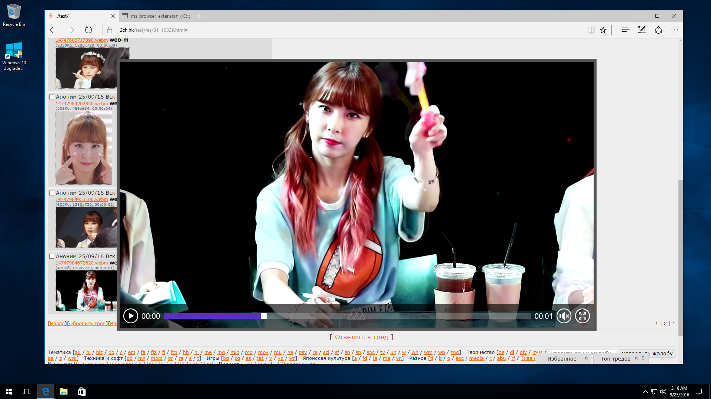

## webmify

Fix sites to make WebMs playable in Edge. Only VP9 and Opus formats currently work.

### Supported sites

* 2ch.hk
* 2ch.pm

### Install

* Install Edge 14+ (Windows 10 Anniversary Update or Insider Build)
* Set "Always on" option for VP9 in about:flags
* Restart Edge
* Install [Tampermonkey](https://www.microsoft.com/en-us/store/p/tampermonkey/9nblggh5162s)
* Install [webmify.user.js](https://raw.githubusercontent.com/Kagami/webmify/master/webmify.user.js)

### Demo

### Known issues

* Tracks with lacing don't work (currenly enabled only by mkvmerge for Opus tracks, use `--disable-lacing`; ffmpeg is fine)
* Sometimes `QuotaExceededError` is raised
* Entire file need to be downloaded to start playback

### Technical details

Latest Edge has support for VP9/Opus MSE tracks but not for a common WebM files. This script splits WebMs into separate video/audio tracks and loads them via MSE API so it can be played in Edge.

### License

[CC0.](COPYING)
